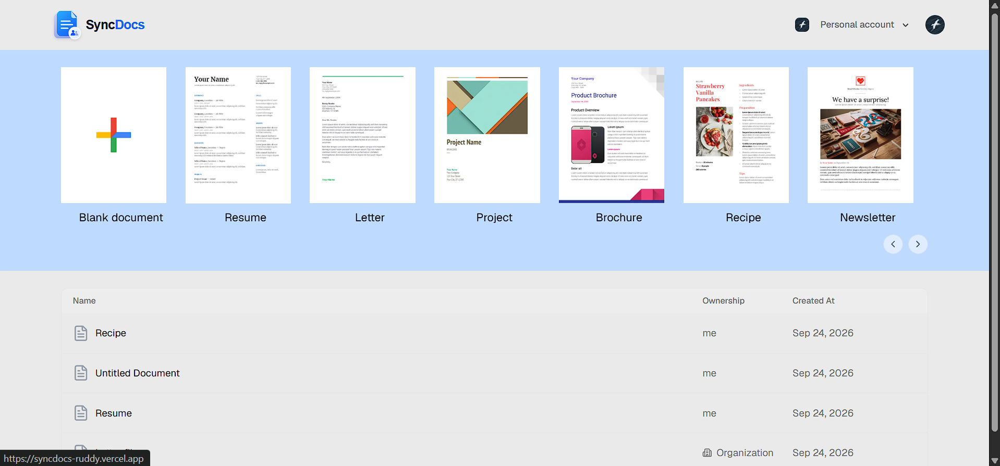
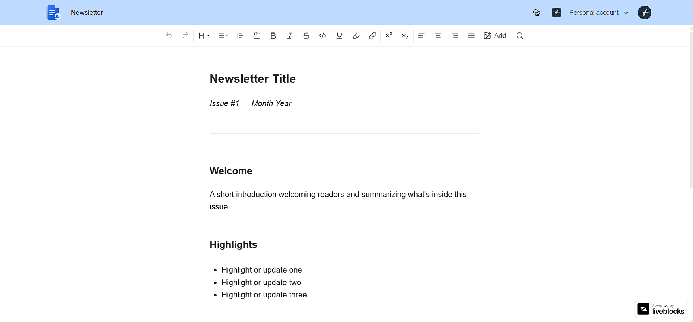
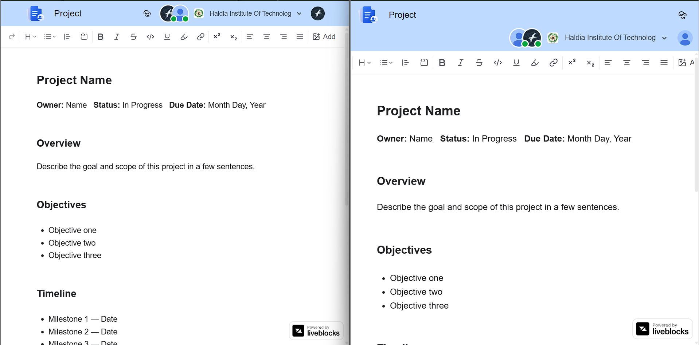
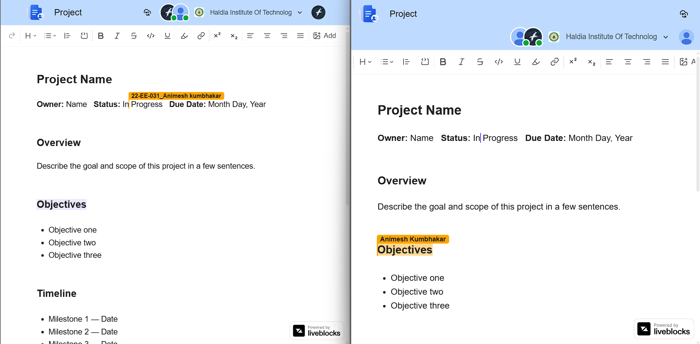
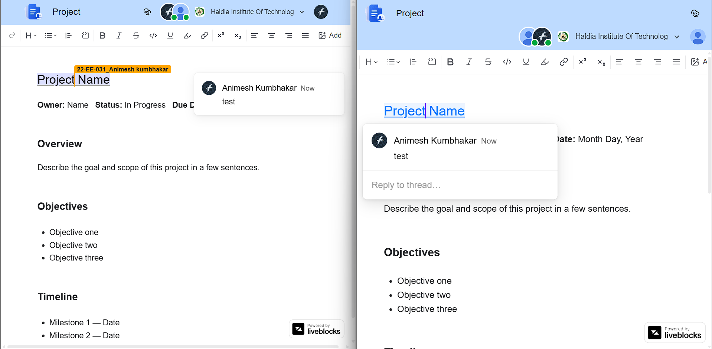
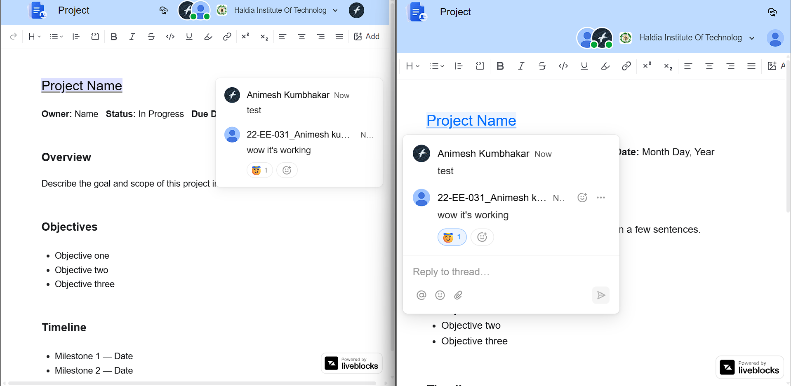
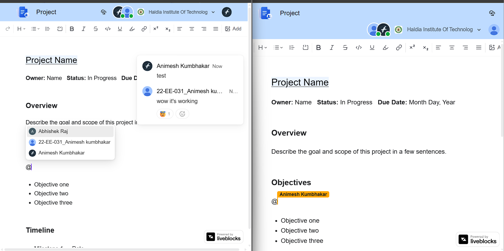
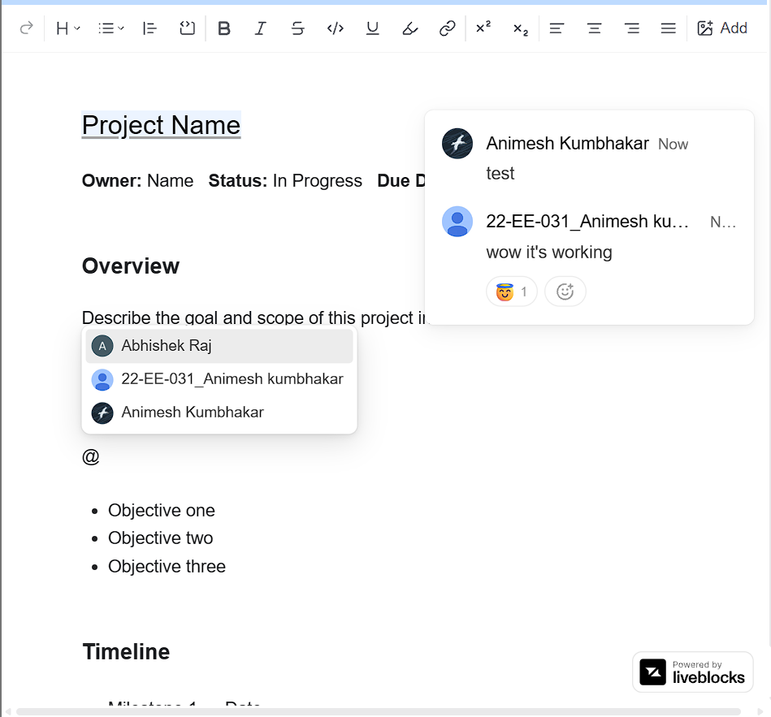

# SyncDocs

## Short Description
SyncDocs is a collaborative document workspace built for teams and individuals to create, manage, and edit rich documents in real time. It combines a sleek document editor with team collaboration, template-based creation, secure authentication, and cloud-powered image uploads.

## Tech Stack
- Next.js 16
- React 19
- TypeScript
- Tailwind CSS
- Convex
- Clerk Auth
- Liveblocks
- Tiptap
- Cloudinary
- shadcn/ui

## Features
- Real-time collaborative editing for team documents
- Document creation from reusable templates
- Rich text editing with formatting toolbar and content styles
- Organization-aware document management
- User and team authentication with Clerk
- Cloud image upload support via Cloudinary
- Document listing, renaming, and organization-based filtering
- Clean modern UI for fast document workflows
- Lightweight and scalable architecture for real-time document experiences

## Demo Video
- Video: https://your-demo-video-link.com

## Screenshots


  
  
 
 
 
 
 
 


## Live View
- Live App: https://syncdocs-ruddy.vercel.app/

## Project Structure
- `src/app` — application pages and routes
- `src/components` — reusable UI and editor components
- `src/lib` — template and editor utility logic
- `convex` — Convex backend schema and document functions

## Getting Started

### 1. Clone & Install
```bash
git clone <your-repo-url>
cd syncdocs
npm install
```

### 2. Environment Variables
Create a `.env.local` file in the project root:

```bash
# Convex
NEXT_PUBLIC_CONVEX_URL=
CONVEX_DEPLOYMENT=

# Clerk
NEXT_PUBLIC_CLERK_PUBLISHABLE_KEY=
CLERK_SECRET_KEY=
NEXT_PUBLIC_CLERK_SIGN_IN_URL=/sign-in
NEXT_PUBLIC_CLERK_SIGN_UP_URL=/sign-up
NEXT_PUBLIC_CLERK_AFTER_SIGN_IN_URL=/
NEXT_PUBLIC_CLERK_AFTER_SIGN_UP_URL=/

# Liveblocks
LIVEBLOCKS_SECRET_KEY=

# Cloudinary
NEXT_PUBLIC_CLOUDINARY_CLOUD_NAME=
NEXT_PUBLIC_CLOUDINARY_UPLOAD_PRESET=
CLOUDINARY_API_KEY=
CLOUDINARY_API_SECRET=
```

### 3. Set Up Convex (Database & Backend Functions)

Convex handles the document database, queries, and mutations.

```bash
npm install convex
npx convex dev
```

Running `npx convex dev` will:
- Prompt you to log in / create a Convex account
- Create a new Convex project (or link an existing one)
- Generate a deployment and automatically populate `NEXT_PUBLIC_CONVEX_URL` and `CONVEX_DEPLOYMENT` in `.env.local`


Once saved, `npx convex dev` automatically pushes this schema and creates the `documents` table in your Convex deployment dashboard — no manual "create table" step needed.

Docs: https://docs.convex.dev/home

### 4. Set Up Clerk (Authentication)

```bash
npm install @clerk/nextjs
```

Steps:
1. Create an application at https://dashboard.clerk.com
2. Copy the **Publishable Key** and **Secret Key** into `.env.local`

3. (Optional, for org-aware docs) Enable **Organizations** in the Clerk dashboard under *Organization Settings*.

Docs: https://clerk.com/docs/quickstarts/nextjs
Convex + Clerk integration: https://docs.convex.dev/auth/clerk

### 5. Set Up Liveblocks (Real-time Collaboration)

```bash
npm install @liveblocks/client @liveblocks/react @liveblocks/node
```

Steps:
1. Create a project at https://liveblocks.io/dashboard
2. Copy the **Secret Key** into `.env.local` as `LIVEBLOCKS_SECRET_KEY`

Docs: https://liveblocks.io/docs/get-started
Liveblocks + Tiptap: https://liveblocks.io/docs/get-started/text-editor/tiptap/nextjs

### 6. Set Up Cloudinary (Image Uploads)
1. Create an account at https://cloudinary.com
2. Copy your **Cloud Name**, **API Key**, and **API Secret** into `.env.local`
3. Create an unsigned upload preset in the Cloudinary dashboard under *Settings → Upload* and set it as `NEXT_PUBLIC_CLOUDINARY_UPLOAD_PRESET`

Docs: https://cloudinary.com/documentation/upload_images

### 7. Run the App
```bash
npm run dev
```

In a separate terminal, keep Convex running:
```bash
npx convex dev
```

Then open http://localhost:3000 in your browser.

## Notes
This project is designed for collaborative document workflows and can be extended with version history, comments, permissions, and additional template packs.
